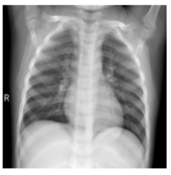
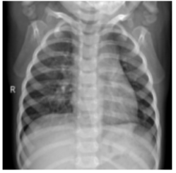
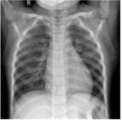
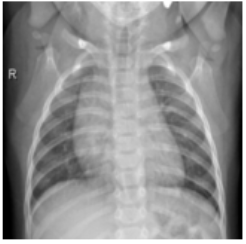
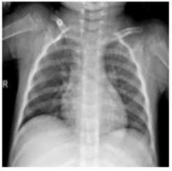
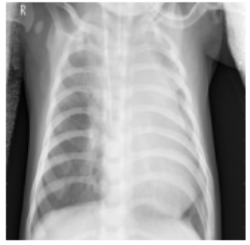
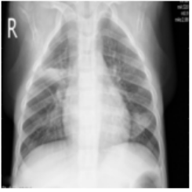
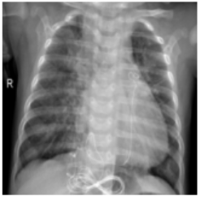
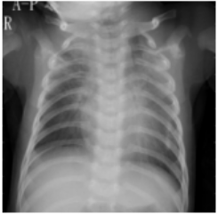
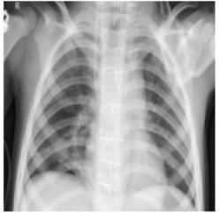

# Chest X-Ray Pneumonia Detection App

## Overview

This project is a deep learning application that predicts whether a chest X-ray indicates **pneumonia** or is **normal**. It leverages a **pretrained DenseNet** model (from [TorchXRayVision](https://github.com/mlmed/torchxrayvision)) that has been **fine-tuned** on a pneumonia dataset. The app is deployed on **Streamlit**, providing an interactive and user-friendly interface.

## Live App

- Check out the deployed app here: [Pneumonia Detection Live App](https://pneumonia-detection-using-torch.streamlit.app/)

## App Demo 
https://github.com/user-attachments/assets/032453a9-5da7-49b1-a161-00fda5d32f00

 ## Sample Chest X-Ray Images from Dataset

Below are sample images from the dataset, showing **Normal** and **Pneumonia** .

| Normal | Normal | Normal | Normal | Normal |
|:-----:|:------:|:------:|:------:|:------:|
|  |  |  |  |  |

| Pneumonia | Pneumonia | Pneumonia | Pneumonia | Pneumonia |
|:---------:|:---------:|:---------:|:---------:|:---------:|
|  |  |  |  |  |

## Features

- **AI-Powered Classification**: Upload a chest X-ray image (PNG/JPG/JPEG) and receive an immediate prediction (Normal or Pneumonia).
- **Pretrained + Fine-Tuned Model**: Uses a DenseNet model pretrained on large chest X-ray datasets, then fine-tuned for pneumonia detection.
- **Interactive Web Interface**: A Streamlit-based web app for quick and intuitive usage.
- **Real-Time Predictions**: Get immediate diagnostic feedback after uploading an image.

## Project Structure
```
├── README.md
├── app.py
├── pneumonia_detection.ipynb
├── best_pneumonia_model.pth
└── requirements.txt
```

## Workflow

1. **Data Preparation**  
   - Collect chest X-ray images (Normal and Pneumonia) from public datasets ( [Kaggle’s pneumonia dataset](https://www.kaggle.com/paultimothymooney/chest-xray-pneumonia)).
   - Splited into training, testing and validation sets.

2. **Model Training**  
   - Fine-tuned a DenseNet model densenet121-res224-all (pretrained on large-scale chest X-ray data) on the pneumonia dataset.
   - Saved the trained weights for inference as best_pneumonia_model.pth.

3. **Web App**  
   - The Streamlit app loads the fine-tuned model.
   - Users upload chest X-ray images, and the model outputs predictions in real time.

4. **Model Deployment**  
   - The trained model is hosted on Streamlit Cloud.
   - Real-time predictions are made available through the web interface.

## Installation

To run this project locally, follow these steps:

1. **Clone the repository**:
   ```bash
   git clone https://github.com/Muhammad-Talha4k/Pneumonia-Detection-using-torch-xray-vision.git
   ```
2. **Prerequisites**:
- `Python 3.8+`
- `(Optional) GPU for faster inference or training`
- `Packages: TorchXRayVision, PyTorch, Streamlit, and others listed in requirements.txt`

3. **Install the required dependencies**:
   ```bash
   pip install -r requirements.txt
   ```
## Usage
Once the app is running, you can:

- Upload a Chest X-ray: Upload your chest X-ray image (PNG/JPG/JPEG)
- The model will classify the image as Normal or Pneumonia.
- The app displays the uploaded image along with a zoomed-in version.
- A clear label (NORMAL or PNEUMONIA) is shown based on the prediction.

## Contributing

Contributions are welcome! If you have any suggestions, bug reports, or feature requests, please open an issue or submit a pull request.

## License
This project is licensed under the MIT License.

## Acknowledgements

**TorchXRayVision**: This project uses the DenseNet model implementation from [TorchXRayVision](https://github.com/mlmed/torchxrayvision), which provides state-of-the-art pretrained models for chest X-ray analysis.

**Kaggle Pneumonia Dataset**: The pneumonia dataset used for fine-tuning was sourced from [Kaggle’s chest X-ray pneumonia dataset](https://www.kaggle.com/paultimothymooney/chest-xray-pneumonia). 

Special thanks to the contributors of the Torch XRAY-Vision library and kaggle for the dataset.
